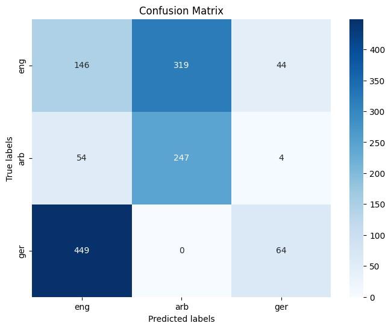
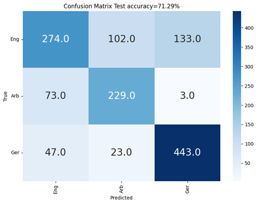

# Spoken Language Identification

This project aims to classify the language spoken in an audio recording. It focuses on three languages: English, Arabic, and German.

## Table of Contents

1. [Task](#task)
2. [Data](#data)
3. [Approaches](#approaches)
   - [Hidden Markov Model (HMM)](#hidden-markov-model-hmm)
   - [Long-short term memory (LSTM)](#long-short-term-memory-lstm)
4. [Results](#results)
   - [HMM](#hmm-results)
   - [LSTM](#lstm-results)

## Task

The goal of this project is to identify the language spoken in a given audio file with a single speaker. The system should classify the language into one of the designated languages: English, Arabic, or German.

## Data

The dataset used is the Fleurs dataset. For this project, we utilized only three languages: English, Arabic, and German. The dataset is already split into train, test, and validation sets, and we used this pre-existing split. 

To ensure uniformity in the length of audio files input to the classifier, we padded smaller audio files to match the larger ones. This introduced a significant amount of padding, which caused the models to be biased towards the zeros from padding. 

We mitigated this by filtering the audios, taking only files with durations ranging between 6-14 seconds. This range covers nearly 70% of the dataset, and by padding 6s audio files to match 14s files, we minimized the impact on model performance.

## Approaches

### Hidden Markov Model (HMM)

- Trained three HMMs, one for each language.
- For classification, the audio file was run through the three models, and the model with the highest probability provided the classification.
- Each model had 10 hidden states and was trained over 50 iterations.

### Long-short term memory (LSTM)

- Trained a recurrent neural network using LSTM to capture temporal dependencies.
- The hidden state of the last time step was fed into a fully-connected layer that outputted the class probability.
- The LSTM network had 5 layers, a dropout rate of 0.5, and a hidden state vector size of 512.

## Results

### HMM Results

- Test accuracy: 34.44%

  

  
  

  

  HMM Confusion Matrix
  

### LSTM Results

- Test accuracy: 71.29%

  

  
  

  

  LSTM Confusion Matrix
  

